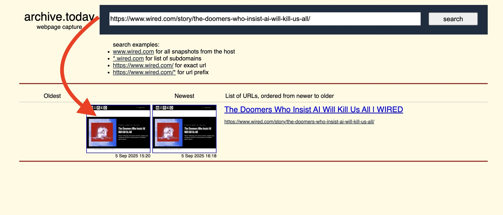
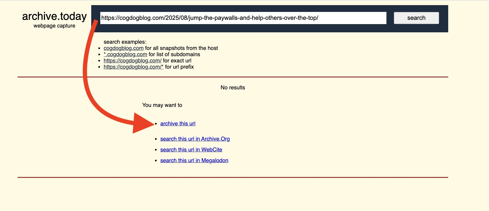
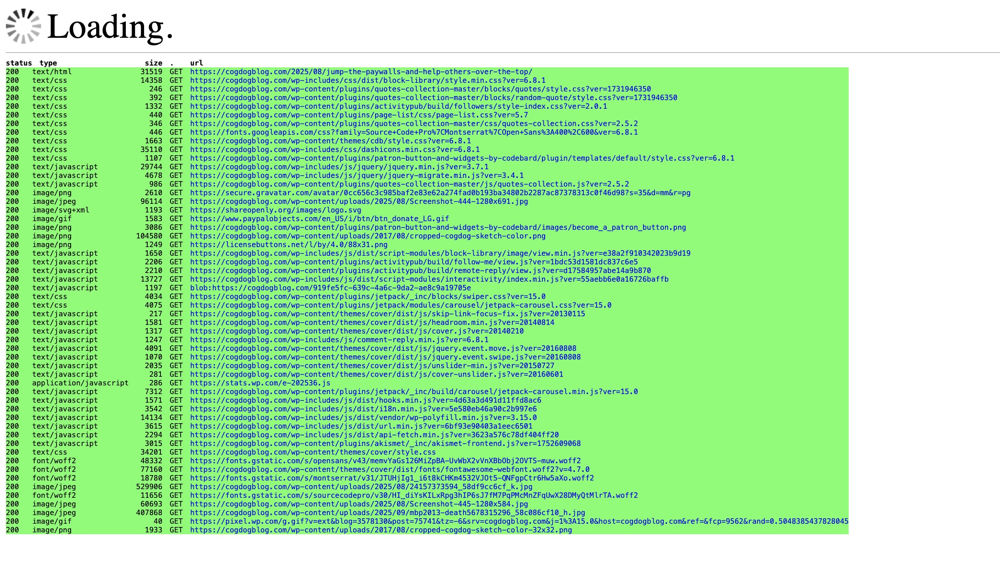

# Paywall Jumper Bookmarklet

by Alan Levine https://cog.dog or http://cogdogblog.com/

Make a bookmarklet for old school way (browser bookmarklets) to jump over all those news sites tat give you a headline, one paragraph, and then block your reading with a pay/subscribe wall. 

This simple tool lets you make use of archive.today to find or create openly readable versions of paywalled articles. Sure it is likely to be hunted down and vanquished by the news cartel, but the creator sure is crafty. 

Some blogger [spewed stuffy about this approach](https://cogdogblog.com/2025/08/jump-the-paywalls-and-help-others-over-the-top/).

*[Album Cover Jump!](https://flickr.com/photos/gomattolson/1161833340) flickr photo by [gomattolson](https://flickr.com/people/gomattolson) shared under a [Creative Commons (BY-SA) license](https://creativecommons.org/licenses/by-sa/2.0/) modified by Alan Levine to include the a screen shot of the paywall shared also under a [Creative Commons (BY) license](https://creativecommons.org/licenses/by/2.0/)*

What? Just try it to see how it works at https://cogdog.github.io/paywalljumper then get the paywall jumper. Just drag the bookmarklet link to your browser search bar.

Let's say <a href="https://www.wired.com/story/the-doomers-who-insist-ai-will-kill-us-all/" target="_blank">you hit the wall on something at Wired.</a>

Jump that wall by clicking the bookmarklet. Is that hard? No! You will be transported to the archive.today web site. If it has been freed up already, you can just click any of the archived versions to read (and make use of the share button feature as needed.)

Click any and read away, no ads, no popups. Make use of the share buttons to save someone else the trouble jumping, see it like [http://archive.today/Ek68M](http://archive.today/Ek68M)

On the other hand, if no one has yet to archive a link, <a href="https://cogdogblog.com/2025/08/jump-the-paywalls-and-help-others-over-the-top/" target="_blank">say some crazy blogger who wrote about archive.today</a>, using the bookmarklet will yield a screen where you can request one to be made. 

Just use the save button on the next screen. It's rather fun to watch the archive in progress!

Now [it's archived](http://archive.today/JIYA1)! (though this is never a paywalled site, just for demo purposes)

## The more direct way
You can actually do this directly from the browser view of a paywalled site by simply inserting `archive/ph/` in front of the offending URL, and pressing return. This makes it a one click option.

## Get Your Own
Head right here and get your own paywall Jumper

https://cogdog.github.io/paywalljumper

